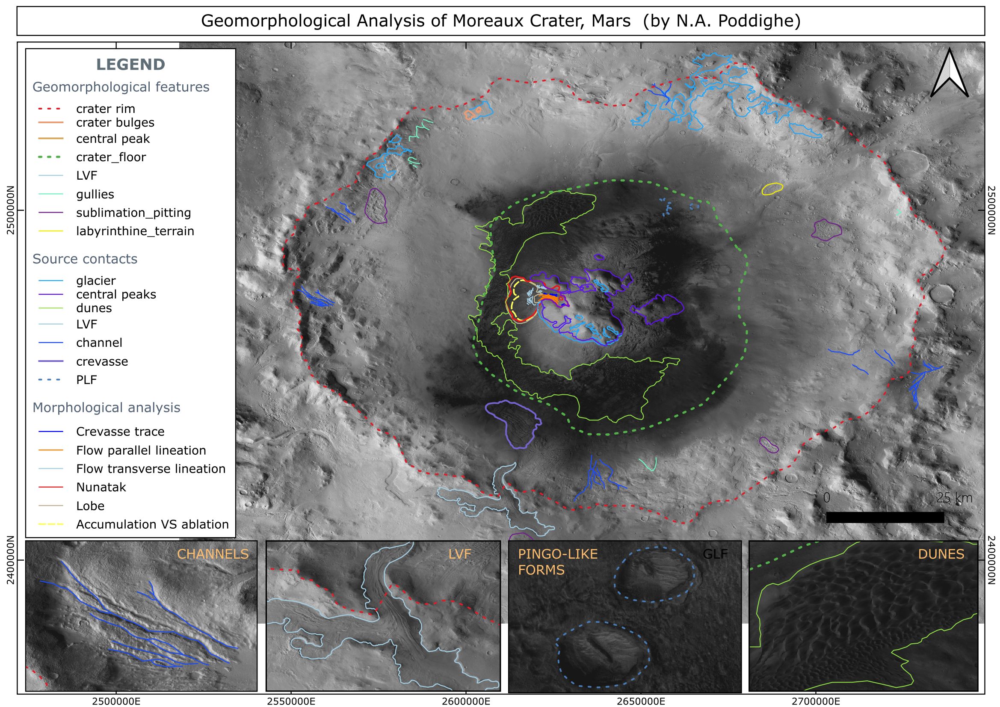

# Geomorphological Mapping of Moreaux Crater, Mars
**Project completed during the GMAP Winter School 2026**

## 📌 Technical Summary
This repository contains the geomorphological analysis of **Moreaux Crater** (centered at 41.6°N, 44.4°E). The mapping was performed using a multi-sensor approach to identify glacial-like forms (GLF) and volatile-related features in the Protonilus Mensae region.

## 🛰️ Dataset & Sensors
* **CTX (Context Camera):** Primary base map for morphological unit boundary definition (~6 m/pixel).
* **HiRISE:** Used for detailed analysis of crevasses, sublimation pitting, and pingo-like forms (~25-50 cm/pixel).
* **THEMIS (Thermal Emission Imaging System):** Day/Night IR used for thermophysical property assessment of dune fields.
* **HRSC / MOLA:** Digital Elevation Models (DEM) for topographic cross-sections and crater depth analysis.

## 🛠️ Software Workflow
* **QGIS:** Main GIS environment for vectorization, attribute table management, and final cartographic layout.
* **Planetary Geocoding:** All data processed using Mars 2000 / Mars Sphere coordinates.

## 🗺️ Final Outputs
### Geomorphological Map

### Extended Context Analysis

---
**N.A. Poddighe | GMAP Winter School 2026**

## 🌋 Volcanic Analysis: Arsia Mons Lava Tubes
Statistical and morphological analysis of pit craters and lava tube skylights on the flanks of Arsia Mons, Mars.

*   **Objective:** Identification and classification of volcanic collapse features (Circular, Elongated, and Atypical pits).
*   **Key Finding:** Statistical dominance of elongated pits, suggesting structural control over tube formation.
*   **Data/Tools:** CTX imagery and QGIS for morphological characterization and histogram generation.

---

## 🌙 Lunar Exploration: Mare Ingenii Landing Site
Landing site selection and traverse planning for the Mare Ingenii region on the Moon.

*   **Objective:** Identifying a safe landing area and scientifically relevant traverse path based on topographic constraints.
*   **DTM Analysis:** Slope classification (Green: < 10°, Yellow: 10-15°, Red: > 15°) to ensure rover trafficability.
*   **Geospatial Analysis:** Elevation profile generation and point-of-interest (POI) mapping using Lunar Reconnaissance Orbiter (LRO) data.
